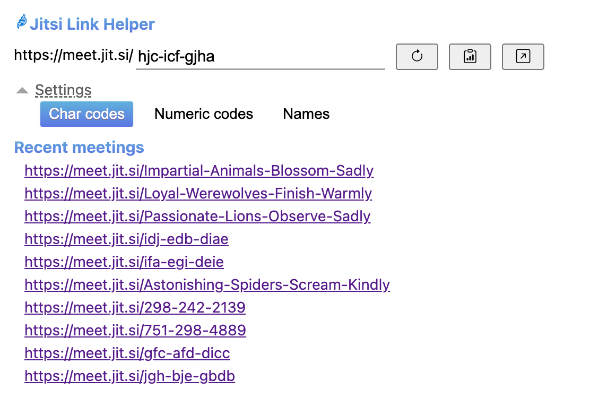

# Jitsi Link Helper - Chrome extension

A simple extension that allows you to create links for meetings on Jitsi platform

## Features
- Create link with different generators
- View recent link meetings

## View

## Authors
* **Alex Yolkin** - [Alex's Github](https://github.com/LugaMuga)

